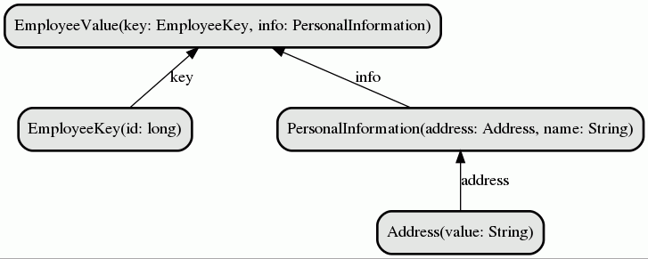

<!-- START doctoc generated TOC please keep comment here to allow auto update -->
<!-- DON'T EDIT THIS SECTION, INSTEAD RE-RUN doctoc TO UPDATE -->
**Table of Contents**  *generated with [DocToc](https://github.com/thlorenz/doctoc)*

- [Avro Compose - Simple Schema Composition Example](#avro-compose---simple-schema-composition-example)
  - [Requirements](#requirements)
    - [Schema types](#schema-types)
      - [Entity schemas](#entity-schemas)
        - [EmployeeValue and EmployeeKey](#employeevalue-and-employeekey)
        - [PersonalInformation](#personalinformation)
        - [Address](#address)
    - [Downloading the avro-compose tool](#downloading-the-avro-compose-tool)
    - [Composing schemas](#composing-schemas)
      - [Changing JSON output format](#changing-json-output-format)
      - [Changing output file names](#changing-output-file-names)
        - [Simple type names as filenames](#simple-type-names-as-filenames)
        - [Namespace dot separated parts as directories (Java package style)](#namespace-dot-separated-parts-as-directories-java-package-style)
        - [Namespace dot separated parts as sub-directories (Java package style #2)](#namespace-dot-separated-parts-as-sub-directories-java-package-style-2)
        - [Combining multiple output schema types into one file](#combining-multiple-output-schema-types-into-one-file)
        - [Combining multiple output schema types into file per-namespace](#combining-multiple-output-schema-types-into-file-per-namespace)
        - [Retain the source file name structure](#retain-the-source-file-name-structure)
        - [Using special keys in source schemas to alter output filenames (-value, -key Kafka style)](#using-special-keys-in-source-schemas-to-alter-output-filenames--value--key-kafka-style)

<!-- END doctoc generated TOC please keep comment here to allow auto update -->

# Avro Compose - Simple Schema Composition Example
## Requirements
- Java 8 JDK, various options: [Zulu](https://www.azul.com/downloads/zulu-community), or [OpenJDK](https://openjdk.java.net/)
- [Maven](https://maven.apache.org/)

### Schema types
Consider we have main entity `Employee`, which we store as a type `EmployeeValue`, since we expect
this entity to be a value of some Kafka topic.
Then we will introduce two subtypes, from which the `Employee` entity will be composed: `EmployeeKey` and `PersonalInformation`.
The latter one will depend on fourth entity: `Address`. This is to demonstrate hierarchical multi-step chaining is possible (Employee <- PersonalInformation <- Address).

Parsing schemas individually would result in exceptions, `EmployeeValue` first need its dependencies to be parsed, but recursively, the `Address` has to come before `PersonalInformation`.
Without ensuring any special order, we throw these bunch of schemas to our tool for automatic chaining and parsing.
  
Here is a picture of our type hierarchy in this example:


#### Entity schemas
##### EmployeeValue and EmployeeKey
Schema for `EmployeeValue` and `EmployeeKey` are defined in file [Employee.avsc](./schemas/Employee.avsc):
```json
{
  "doc": "This is an example of composite Avro value prepared for Kafka topic value with subtype, reusing common subtypes, like Location and PersonalInformation",
  "type": "record",
  "name": "com.michalklempa.avro.schemas.employee.EmployeeValue",
  "outputFileSuffix": "-value",
  "fields": [
    {
      "doc": "Lets repeat the key of this record, even if the record is outside Kafka topic, to retain the key of Employee",
      "name": "key",
      "type": {
                "doc": "This is an example of composite Avro key prepared for Kafka",
                "type": "record",
                "name": "com.michalklempa.avro.schemas.employee.EmployeeKey",
                "outputFileSuffix": "-key",
                "fields": [
                  {
                    "doc": "Employee id with regard to the company",
                    "name": "id",
                    "type": "long"
                  }
                ]
              }
    },
    {
      "doc": "Employee Personal Information (which includes Location as a subtype)",
      "name": "personalInformation",
      "type": "com.michalklempa.avro.schemas.simple.PersonalInformation"
    }
  ]
}
```
There are two non-standard json key in this schema:
```json
...
  "outputFileSuffix": "-value",
...
  "outputFileSuffix": "-key",
```
This will be later used in execution of generator for specifying the output filename for the type `EmployeeValue`.

There are two sub-types required:
- `com.michalklempa.avro.schemas.keys.EmployeeKey` - this one is readily present in the file
- `com.michalklempa.avro.schemas.common.PersonalInformation` - this has to be loaded before parsing this file

##### PersonalInformation
`PersonalInformation` can be found in file [PersonalInformation.avsc](./schemas/PersonalInformation.avsc).
```json
{
  "doc": "PersonalInformation, including Location as a subtype",
  "type": "record",
  "name": "com.michalklempa.avro.schemas.simple.PersonalInformation",
  "fields": [
    {
      "doc": "Address",
      "name": "address",
      "type": "com.michalklempa.avro.schemas.simple.Address"
    },
    {
      "name": "name",
      "type": {
        "type": "string",
        "avro.java.string": "String"
      }
    },
    {
      "name": "surname",
      "type": {
        "type": "string",
        "avro.java.string": "String"
      }
    }
  ]
}
```

##### Address
`Address` can be found in file [Address.avsc](./schemas/Address.avsc).
```json
{
  "doc": "Address",
  "name": "com.michalklempa.avro.schemas.simple.Address",
  "type": "record",
  "fields": [
    {
      "name": "value",
      "type": {
        "type": "string",
        "avro.java.string": "String"
      }
    }
  ]
}
```

### Downloading the avro-compose tool
To download the avro-compose JAR file, we may run the following command:
```bash
mvn dependency:copy -Dartifact=com.michalklempa:avro-compose:0.0.1 -DoutputDirectory=.
```

Or head to the [avro-compose github repository](https://github.com/michalklempa/avro-compose)
and download the latest release there.

### Composing schemas
To compose the schema files and output each Avro named type into single file, we may run the minimal command:
```bash
java -jar avro-compose-0.0.1-shaded.jar --output.schemas.directory ./generated/ ./schemas/ 
```
If everything goes well, we should see the generated schemas:
```bash
$ tree generated/
generated/
├── com.michalklempa.avro.schemas.employee.EmployeeKey.avsc
├── com.michalklempa.avro.schemas.employee.EmployeeValue.avsc
├── com.michalklempa.avro.schemas.simple.Address.avsc
└── com.michalklempa.avro.schemas.simple.PersonalInformation.avsc
```

Inspecting the `./generated/com.michalklempa.avro.schemas.employee.EmployeeValue.avsc`:
```json
{
  "type" : "record",
  "name" : "EmployeeValue",
  "namespace" : "com.michalklempa.avro.schemas.employee",
  "doc" : "This is an example of composite Avro value prepared for Kafka topic value with subtype, reusing common subtypes, like Location and PersonalInformation",
  "fields" : [ {
    "name" : "key",
    "type" : {
      "type" : "record",
      "name" : "EmployeeKey",
      "doc" : "This is an example of composite Avro key prepared for Kafka",
      "fields" : [ {
        "name" : "id",
        "type" : "long",
        "doc" : "Employee id with regard to the company"
      } ],
      "outputFileSuffix" : "-key"
    },
    "doc" : "Lets repeat the key of this record, even if the record is outside Kafka topic, to retain the key of Employee"
  }, {
    "name" : "personalInformation",
    "type" : {
      "type" : "record",
      "name" : "PersonalInformation",
      "namespace" : "com.michalklempa.avro.schemas.simple",
      "doc" : "PersonalInformation, including Location as a subtype",
      "fields" : [ {
        "name" : "address",
        "type" : {
          "type" : "record",
          "name" : "Address",
          "doc" : "Address",
          "fields" : [ {
            "name" : "value",
            "type" : {
              "type" : "string",
              "avro.java.string" : "String"
            }
          } ]
        },
        "doc" : "Address"
      }, {
        "name" : "name",
        "type" : {
          "type" : "string",
          "avro.java.string" : "String"
        }
      }, {
        "name" : "surname",
        "type" : {
          "type" : "string",
          "avro.java.string" : "String"
        }
      } ]
    },
    "doc" : "Employee Personal Information (which includes Location as a subtype)"
  } ],
  "outputFileSuffix" : "-value"
}
```
As we can see, the sub-types were replaced by appropriate sub-type definitions and this file now contains the complete
materialized schema for `EmployeeValue` entity.

#### Changing JSON output format
We can instruct the tool to output JSON in one-line format or in [Parsing Canonical Form](http://avro.apache.org/docs/current/spec.html#Parsing+Canonical+Form+for+Schemas).
These two modes have the option: `--output.schemas.format oneline` and `--output.schemas.format canonical` respectively.
In these modes, the output files are appended, so we need to remove the contents of `./generated/` directory before proceeding:
```bash
rm ./generated/*
```

One-line format example:
```bash
java -jar avro-compose-0.0.1-shaded.jar --output.schemas.directory ./generated/ --output.schemas.format oneline ./schemas/
```

Canonical format example:
```bash
java -jar avro-compose-0.0.1-shaded.jar --output.schemas.directory ./generated/ --output.schemas.format canonical ./schemas/
```

#### Changing output file names
We can change the naming strategy for output filenames. After parsing, the tool has these variables available for each Avro type:

| Variable                        | Example value                                                        | Description                                                                                                                         |
|---------------------------------|----------------------------------------------------------------------|-------------------------------------------------------------------------------------------------------------------------------------|
| `{{ source.basename }}`         | EmployeeValue.avsc                                                   | basename of input file, where the type was found                                                                                    |
| `{{ source.full }}`             | ./avro/EmployeeValue.avsc                                            | full name (including subdirectories starting at working directory) of input file, where the type was found                          |
| `{{ source.absolute }}`         | /home/michalklempa/avro-model/example-simple/avro/EmployeeValue.avsc | absolute path on local filesystem                                                                                                   |
| `{{ schema.name }}`             | EmployeeValue                                                        | short schema type name, e.g. Employee                                                                                               |
| `{{ schema.fullname }}`         | com.michalklempa.avro.schemas.simple.EmployeeValue                   | short schema type name, e.g. com.michalklempa.avro.Employee                                                                         |
| `{{ schema.namespace }}`        | com.michalklempa.avro.schemas.simple                                 | namespace part of name, if any. e.g. com.michalklempa.avro                                                                          |
| `{{ schema.doc }}`              | This is an example of composite Avro...                              | 'doc' part of root schema type. If you want to do some magic around encoding file name in doc field.                                |
| `{{ schema.props.<property> }}` |                                                                      | any property you add into root schema, which is not recognized by Avro, is preserved, and you can use it to define output filename. |

The `source.` variables are take from source file, where the type was found. There may be more than one type in one source file, so take it into account.
The `schema.` variables are derived from the Avro schema type itself. 

There is a special sub-space of `schema.props` variables, where all Avro non-recognized properties
fallback. So in our example, there will be present:

| Variable                              | Example value |
|---------------------------------------|---------------|
| `{{ schema.props.outputFileSuffix }}` | -value        |

We can use these variables to specify the output filename for each type, by providing a [jinja2](https://jinja.palletsprojects.com/en/2.11.x/templates/) 
template string as a filename.

##### Simple type names as filenames
Lets remove the namespace from filenames and use only the simple type name (the last part):
```bash
java -jar avro-compose-0.0.1-shaded.jar --output.schemas.directory ./generated/ --output.schemas.filename.template "{{ schema.name }}.avsc"  ./schemas/ 
```

Output layout:
```
generated/
├── Address.avsc
├── EmployeeKey.avsc
├── EmployeeValue.avsc
└── PersonalInformation.avsc
```

##### Namespace dot separated parts as directories (Java package style)
Lets put each file into a corresponding subdirectory with naming from the namespace.

One option is flat package style, when directory name is namespace name:
```bash
java -jar avro-compose-0.0.1-shaded.jar --output.schemas.directory ./generated/ --output.schemas.filename.template "{{ schema.namespace }}/{{ schema.name }}.avsc"  ./schemas/ 
```
Output layout:
```
generated/
├── com.michalklempa.avro.schemas.employee
│   ├── EmployeeKey.avsc
│   └── EmployeeValue.avsc
└── com.michalklempa.avro.schemas.simple
    ├── Address.avsc
    └── PersonalInformation.avsc
```

##### Namespace dot separated parts as sub-directories (Java package style #2)
Another common used package style option is to create subdirectories for every dot-separated part of namespace.
This can be achieved with jinja2 filters, replacing the '.' with directory separator '/':
```bash
java -jar avro-compose-0.0.1-shaded.jar --output.schemas.directory ./generated/ --output.schemas.filename.template "{{ schema.namespace | replace('.', '/') }}/{{ schema.name }}.avsc"  ./schemas/ 
```

Output layout:
```
generated/
└── com
    └── michalklempa
        └── avro
            └── schemas
                ├── employee
                │   ├── EmployeeKey.avsc
                │   └── EmployeeValue.avsc
                └── simple
                    ├── Address.avsc
                    └── PersonalInformation.avsc
```

##### Combining multiple output schema types into one file
We can combine the output types into single file, or retaining the file naming structure from source files.
To output into single file, we also change the `--output.schemas.format` to `oneline`. The filename can be static:
```bash
java -jar avro-compose-0.0.1-shaded.jar --output.schemas.directory ./generated/ --output.schemas.format oneline --output.schemas.filename.template "all.avsc"  ./schemas/ 
```
Output layout:
```
generated/
└── all.avsc
```

##### Combining multiple output schema types into file per-namespace
Combine schemas to files per-namespace:
```bash
java -jar avro-compose-0.0.1-shaded.jar --output.schemas.directory ./generated/ --output.schemas.format oneline --output.schemas.filename.template "{{ schema.namespace }}.avsc"  ./schemas/ 
```
Output layout:
```
generated/
├── com.michalklempa.avro.schemas.employee.avsc
└── com.michalklempa.avro.schemas.simple.avsc
```
##### Retain the source file name structure
Retain the source file name (if there is more than one type defined in source file, there will be more than one in output):
```bash
java -jar avro-compose-0.0.1-shaded.jar --output.schemas.directory ./generated/ --output.schemas.format oneline --output.schemas.filename.template "{{ source.basename }}"  ./schemas/ 
```
Output layout:
```
generated/
├── Address.avsc
├── Employee.avsc
└── PersonalInformation.avsc
```

##### Using special keys in source schemas to alter output filenames (-value, -key Kafka style)
We can use the values of Avro non-parsable (and thus ignored) keys in input schemas, to append values to output filenames.
With Employee type designed as EmployeeKey and EmployeeValue, which the Kafka style naming for key and value schema of topic data,
we can output filenames with these suffices.
In our source file, we have:
```
...
    "name" : "EmployeeKey",
    "outputFileSuffix" : "-key"
...
```
That is, the `outputFileSuffix` is associated with type `EmployeeKey`.
We can grab this extra JSON key (or any other names we use), and use it in the output filename template.
In this example, we output Confluent Schema Registry default [topic naming strategy](https://docs.confluent.io/current/schema-registry/serializer-formatter.html#overview).

Lets output the variable `outputFileSuffix` as part of output filename:
```bash
java -jar avro-compose-0.0.1-shaded.jar --output.schemas.directory ./generated/ --output.schemas.format oneline --output.schemas.filename.template "{{ schema.name }}{{ schema.props.outputFileSuffix }}.avsc"  ./schemas/ 
```

Output layout:
```
generated/
├── Address.avsc
├── EmployeeKey-key.avsc
├── EmployeeValue-value.avsc
└── PersonalInformation.avsc
```

This way, we can also encode any property we have in source data (e.g schema version).